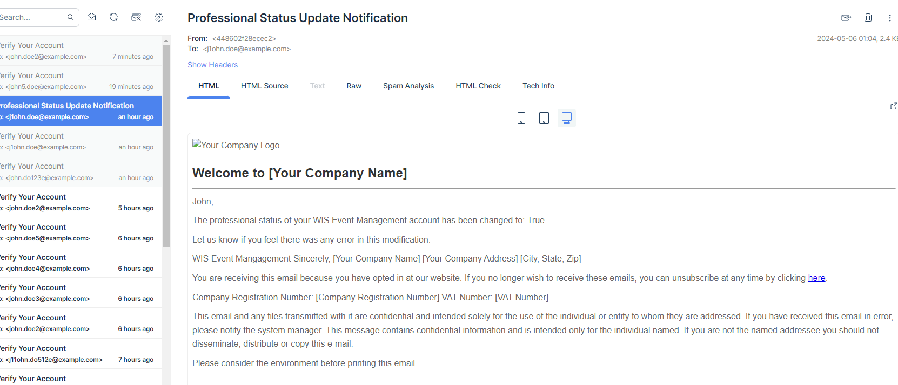

# Introduction

Throughout this project I learned a ton about debugging and troubleshooting applications. More importantly, I feel like I learned a lot more about test driven development. I'm still in the habbit of writing something and getting far too from writing tests before I finally realize I have to go back and write them. During this project I tried to keep tests relatively close instead of leaving them until the end.

I learned a lot about careful reading of documentation as well as the resilience needed to see something complex through to its end. I was really unfamiliar with APIs before the Homework 9 a few weeks ago, so I've been doing everything I can to familiarize myself with how they work via this project. While I feel like I did struggle a lot in some areas since I lack a computer science background, I do feel like I learned a great deal not only from this project but the class as a whole.

# Issues

* [/myaccount Endpoint returns null values for populated database info #8](https://github.com/TyHys/user_management/issues/8)
* [/register/ Endpoint presents incomplete data #6](https://github.com/TyHys/user_management/issues/6)
* [Admin User Erroneously Converts to "Authenticated" #4](https://github.com/TyHys/user_management/issues/4)
* [Verification Link Error #2](https://github.com/TyHys/user_management/issues/2)
* [LibC Vulnerability - Preventing Docker Deployment #1](https://github.com/TyHys/user_management/issues/1)

# Tests
* [Two tests were developed for the event schemas to test some edge cases.](https://github.com/TyHys/user_management/commit/a0142b00ea526b903b5040dd7526e634178b6397#diff-290282138412a840643c110987874d7b4c32259148ea54e8ca419ccacbcb6527)
* [Three more tests were developed for testing the change is-professional endpoint.](https://github.com/TyHys/user_management/commit/9111cc08c4f6f98a8a476016c59d39b9ffc245a6#diff-1d7b620623536f4fb4d120c0d59e8a3ad15f248d9f7af6aa9aa8965cfe923ef9)
* [Five more tests were later written in the event schema and user service tests.](https://github.com/TyHys/user_management/commit/98bf6e8d049ab4c09b2a2f5d21527a541ab6452b)

I focused on adding the user management feature: a method to modify the professional status of an individual and a feature so that users can update their own profile.

Here you can see where a user was successfully notified via email of their email, received after the status was updated ([Link to the commit](https://github.com/TyHys/user_management/commit/9111cc08c4f6f98a8a476016c59d39b9ffc245a6#diff-f2b3ba8fa16caedf3a421cca398204d903883799a3e986e4024356facad8aaab)):
 

 

# Developer Notebook:
* Composed the docker image and navigated to PGAdmin, got Postgres setup per instructions. No issues.
* Ran the Alembic migration script to load the tables/schemas in Postgres, no issues.
* Navigated to http://localhost/docs & registered a new user successfully.
    * It took me a long time to realize the admin authentication method from Homework 10 no longer worked and I burned a few days here before asking others in the Discord.
    * After this I realized that I needed to begin by registering a user when I have no authentication.
* Authenticated the user via the email being the 'user id' (I'm not proud of how long it took me to realize that the user ID was the email and not the UUID).
* Executed the Get User endpoint successfully, returned the correct data.
* Spent several days (intermitently) trying to figure out why an email was not received in MailTrap.
    * Realized that an email isn't sent for the initial admin user. (ouch)
* Registered a second user, successfully received email into MailTrap.
* Link didn't appear to be valid. Modified the user_service.py to correct for invalid token in link.
* Clicked the link within the email, and logged in successfully.
* Queried the users table & saw that the email_verified bool was flipped to TRUE for the user.
* Admin user was changed to authenticated in Postgres
* Added check to see that user is ANONYMOUS in user_service.py as well.
* Noticed that registering a user doesn't actually show you the full details in the response body.
* Modified the response model in user_management/app/routers/user_routes.py to correct for this.
* Noticed a similar issue in the response model for the /myaccount endpoint.
    * Corrected this, similar to the preivous issue.
* Added a route to change the professional status of an account.
* Added an email template and successfully tested the automatic sending.
* Wrote new tests for the additional endpoint